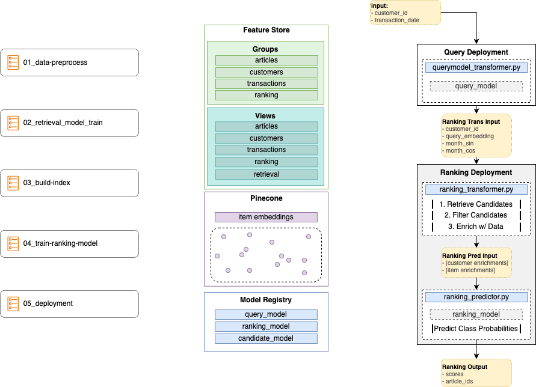

### Personalized Recommender System:
This project is a basic implementation of a real-time, personalized recommendation system. Adapted from a Hopsworks project (see resources) to include the use of the Pinecone vector database and AWS Sagemaker. 
It features the H&M Personalized Fashion Recommendation Dataset and makes recommendations based on the following features:
- User Profile & History
- Item Features
- Realtime Customer Transaction Behavior

Incoming customer behavior information retrieves candidate item embeddings which are filtered by relevance (purchase behavior), enriched with user history and finally ranked to output top-k recommended items.

### Project Overview
Due to the sligtly complex nature of the project sequence, data sources, storage, and eventual deployment orchestration, the diagram below was created to provide a conceptual overview of the interacting components in this project:

Future work will see the addition of more features, model optimizations and a transition to deployments within the AWS ecosystem for further control and customization. 

### Resources:
- H&M Recommendation Dataset: https://www.kaggle.com/competitions/h-and-m-personalized-fashion-recommendations/data
- Tensorflow Recommenders: https://github.com/tensorflow/recommenders
- Hopsworks Project Repo: https://github.com/logicalclocks/hopsworks-tutorials/tree/master/advanced_tutorials/recommender-system
- Pinecone Vector Database: https://www.pinecone.io/
